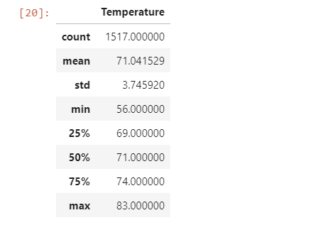

# surfs_up

## Overview
W. Avy wants more information about temperature trends before opening the surf shop. In order to determine if the surf and ice cream shop business is sustainable year-round, he wants temperature data for the months of June and December in Oahu.

## Results

#### June

#### December

- Historically, summer is usually high temperatures. In this case, June and Dec have similar temperatures.

- December which is in the season of winter actually had an mean of 71 as seen above which is great weather not too hot nor not too cold. Surf and ice cream shop will still be subsstiana 

- June was not hot, it had a minimum of 56 and a maximum of 8, not too far off the maximum of December which was 85.

- There are more temperatures in June recorded than December which could not give the full comparison as needed.

## Summary
